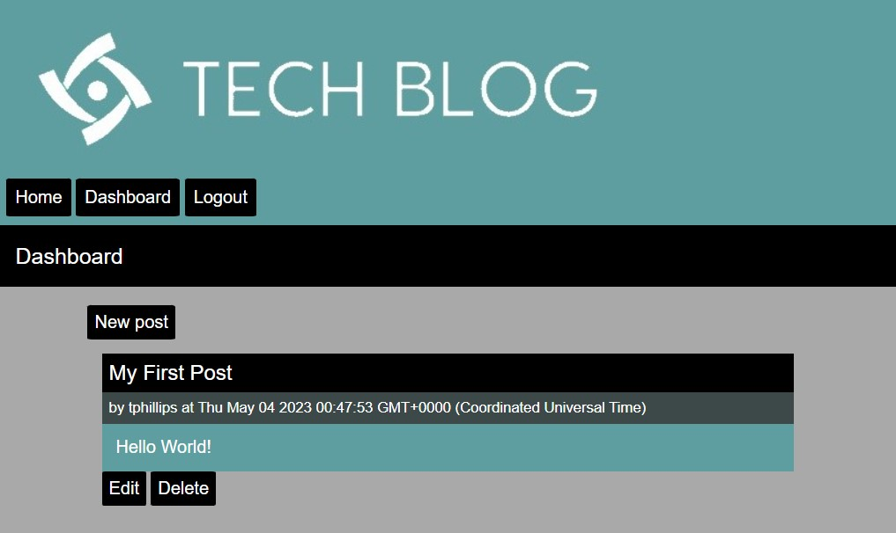

# Tech-Blog

---
## Table of Contents
* [Description](#description)
* [Application](#application)
* [Contributing](#contributing)
* [Tests](#tests)
* [Licence](#licence)
* [Questions](#questions)

---
## Description
Introducing a tech blog platform built with developers in mind. Our CMS-style site provides a space where developers can share their ideas, insights, and knowledge with the community. Our app follows the Model-View-Controller paradigm, ensuring a well-structured architecture. Using Handlebars.js as the templating language and Sequelize as the ORM, developers can easily create, edit, and publish their blog posts, while also commenting and engaging with other developers' content. With the express-session npm package, our app provides secure authentication to ensure a safe and welcoming environment for all. Join our community and elevate your technical writing and communication skills with our platform.

[BACK TO TOP](#top)

---
## Application

Application is Deployed [here](https://tep-tech-blog.herokuapp.com/)

---
## Contributing
We welcome and encourage contributions from the community. If you are interested in contributing to this project, you can help by contributing code by forking the repository, making your changes, and submitting a pull request. Thank you for considering a contribution to this project!

[BACK TO TOP](#top)

---
## Tests
Test scripts were not included in this project.

[BACK TO TOP](#top)

---
## Licence
This project is licenced by MIT License

[BACK TO TOP](#top)

---
## Questions
Please visit my [GitHub Profile](https://github.com/teriannephillips)

[E-mail me](mailto:phillips.terianne@gmail.com) if you have any further questions!

[BACK TO TOP](#top)

